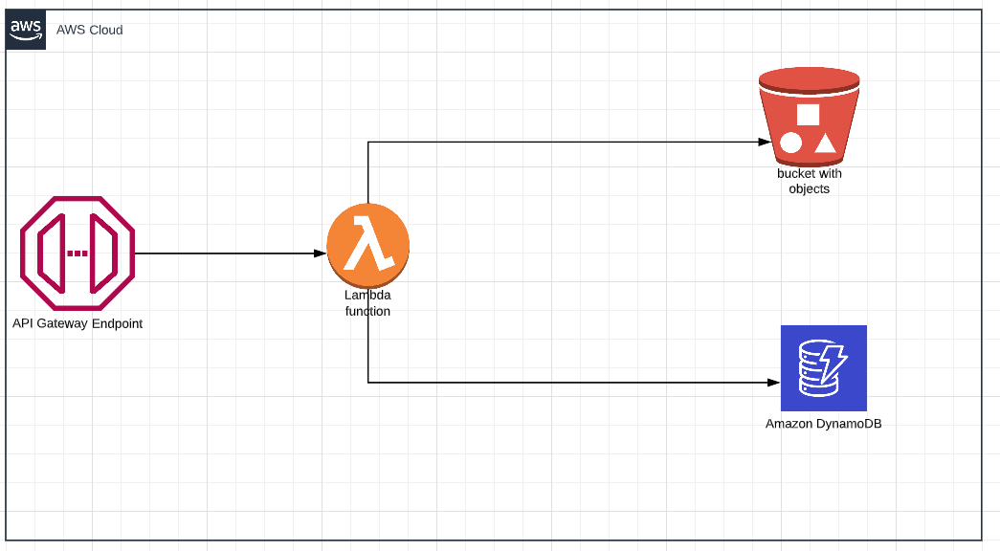

# github-action-with-sam

This project contains source code and files fora serverless application that you can deploy to using SAM.

This source code will deploy a  stack on aws which will consist of a s3 bucket , API Gateway , DynamoDB table and a lambda function.

The API gateway consist a resource  "/upload"  a POST method which will send reuest to lambda function .

The lambda function consist of a Fast API which will add images send in requets to s3 bucket and will store the corresponding metadata in dynamodb table.

